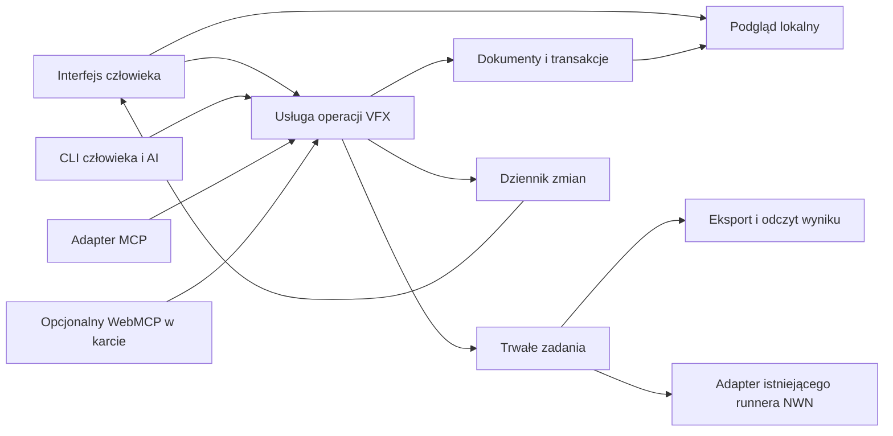

# VFX Studio — sterowanie przez człowieka i AI

Data: 2026-09-05. Status: **docelowy kontrakt; częściowo wdrożony w wersji 0.1.0 alpha**. Obecny zakres CLI/API i wyniki testów opisuje [raport](C:/Projects/nwn-vfx/docs/releases/0.1.0/acceptance.md); projektowane przykłady niżej nie oznaczają pełnej implementacji V1. Dokument uzupełnia [kontrakt autora v1](<C:/Projects/the last city/docs/contracts/tlc-vfx-studio-agent-contract-v1.md>); nie ogłasza zgodności z hostem MCP/WebMCP.

Wymaganie użytkownika: człowiek i AI obsługują tę samą aplikację webową; CLI jest obowiązkowe. Na kolejne polecenie wspólnego ustalenia kierunku wybrano osobne Studio w `C:\Projects\nwn-vfx`. Podstawowy interfejs działa w przeglądarce i korzysta z backendu API, uruchamianego początkowo lokalnie. Adapter testów zainstalowanego NWN/Toolsetu jest oddzielną możliwością; edycja, podgląd i pobieranie eksportu działają bez niego. Rozstrzygnięcia produktu, stacku i zakresu są w [kierunku produktu](C:/Projects/nwn-vfx/docs/design/product-direction.md); ten dokument uszczegóławia sterowanie. Wybór osobnej aplikacji nie oznacza zgody na kopiowanie komponentów między projektami.

## 1. Jeden model operacji



Wzorzec: **rdzeń domenowy z adapterami**, rozdzielenie odczytu i zapisu, rewizje oraz dziennik zmian. Nie wymaga mikroserwisów, pełnego event sourcingu ani CRDT. UI, CLI i narzędzia agentów nie mają osobnych reguł edycji, generatorów ani niezależnego zapisu tych samych plików.

Lokalna usługa jest właścicielem zapisu. CLI łączy się z tą samą instancją co UI. Tryb bez otwartej przeglądarki nadal korzysta z tej usługi; nie omija jej przez bezpośrednie nadpisanie projektu. Trwały stan nie może żyć wyłącznie w React, localStorage lub procesie adaptera MCP.

Wybrany magazyn: jedna lokalna baza SQLite przez adapter `better-sqlite3` na rewizje, operacje, klucze idempotencji, zadania i zdarzenia; duże niezmienne zasoby w magazynie plikowym indeksowanym hashem. Wersje, migracje i zasady blokady wymagają sprawdzenia podczas wdrożenia. Nie jest to przetestowana konfiguracja.

Zapis rewizji, rezultatu komendy, idempotencji i zdarzenia ma jedną transakcję. Przyjęcie joba również atomowo zapisuje `jobId`, snapshot wejścia, idempotencję i zamiar uruchomienia, zanim zwróci `accepted`. Worker pobiera tylko zatwierdzone zadania. Restart między commitem a wykonaniem nie może zgubić pracy; niepewny skutek zewnętrzny wymaga uzgodnienia z rzeczywistym stanem, bez automatycznego powtórzenia.

Publikacja zdarzeń następuje po commit; odczyt po reconnect nadrabia trwały dziennik. Artefakt staje się dostępny dopiero po zakończeniu zapisu, sprawdzeniu hasha i rejestracji. Plik tymczasowy nie jest wynikiem zadania.

## 2. Równorzędna obsługa w UI i CLI

Każda **trwała funkcja produktu** ma operację domenową i wejście CLI. Nie trzeba wystawiać każdego hovera, piksela ani przewijania panelu. Operacje kontekstu widoku są jawne, oddzielone od zapisu projektu i wymagają konkretnego `viewSessionId`.

| Grupa | Wymagane operacje | Oczekiwany rezultat |
| --- | --- | --- |
| Odkrywanie | `doctor`, wersje, capabilities, katalog/schemat operacji | Wykonawca wie, co działa w tym profilu i instalacji |
| Projekty | list, resolve, create, inspect, import, fork, export edytowalnego projektu | Nowy użytkownik i AI mogą rozpocząć i przenieść pracę |
| Warstwy | add, duplicate, remove, reorder, enable, parameter/curve/asset set | Pełna kompozycja efektu, z jawnym wpływem na zależności |
| Ograniczenia | inspect, set, remove | Zablokowany timing/zasób/parametr ma zapisany zakres i autora |
| Historia | revisions list/get, changes preview/apply/revert, revision restore | Cofnięcie pojedynczej zmiany i odtworzenie całego stanu są odrębne |
| Zasoby | import, list, inspect, resolve dependencies | Pochodzenie, hashe, kolizje nazw i kolejność HAK |
| Jakość | validation, variants, compare, review add/update | Uwagi do warstwy/czasu/wersji; akceptacja ma rzeczywistego autora |
| Wykonanie | preview request, candidate build, native test request | Trwałe `jobId`, dokładny snapshot i rzeczywiste artefakty |
| Zadania | list, get, events, cancel | Możliwość odzyskania kontekstu, nawet po utracie odpowiedzi |
| Widok | view inspect, selection set, layer solo, timeline seek/play/pause | Agent może wskazać człowiekowi zmianę w konkretnej karcie |

Nowych nazw nie trzeba rozbijać na dziesiątki osobnych narzędzi MCP. UI/CLI mogą udostępniać wygodne czasowniki, a część mutacji mapować na zamkniętą unię typów `patch`. Jedno znaczenie operacji ma jeden schemat, implementację i testy. Capabilities reklamują tylko zaimplementowany podzbiór.

`apply` utrwala rewizję, więc osobne domenowe `save` nie jest konieczne. Przycisk „Zapisz” w UI zatwierdza lokalną propozycję jako `apply`. „Eksport projektu” zapisuje przenośny dokument, zasoby, wersję schematu i pochodzenie; „Build kandydata” generuje zasoby NWN. To różne operacje. Import MDL z nieobsługiwanymi polami raportuje ograniczenie zamiast tworzyć pozornie kompletny projekt.

## 3. Wspólna edycja i kontrola człowieka

Mutacja istniejącego dokumentu wymaga `expectedRevision`, zakresu praw i stabilnego klucza idempotencji. Utworzenie/import nowego projektu wymaga nieistnienia docelowej tożsamości; import do istniejącego dokumentu wymaga jego rewizji. Job wiąże dokładny snapshot/kandydata, a operacja widoku konkretny `viewSessionId`. Aktor wynika z uwierzytelnionego wykonawcy; pole JSON nie nadaje uprawnień. Dziennik pokazuje również adapter, `operationId`, zmienione warstwy i wartości przed/po.

Zakres idempotencji obejmuje wykonawcę, workspace/projekt i nazwę operacji. Fingerprint obejmuje kanoniczne wejście semantyczne, bez transportowego `requestId`. Po sprawdzeniu dostępu najpierw rozpoznajemy wykonane już identyczne polecenie, dopiero dla nowego sprawdzamy bieżącą rewizję. Ten sam klucz z inną treścią daje `IDEMPOTENCY_CONFLICT`. Przy tworzeniu projektu zakres używa workspace i jawnej tożsamości utworzenia, nie dopiero później przydzielonego ID. Zgodnie z kontraktem v1 minimalne wiązanie klucza z fingerprintem i rezultatem zachowujemy przez życie projektu; wygaśnięcie pełnego wyniku daje `IDEMPOTENCY_RESULT_EXPIRED` i zachowany identyfikator, bez odblokowania powtórnego skutku. Polityka usunięcia projektu i jego rejestru musi zostać określona przed udostępnieniem takiej operacji.

UI rozróżnia ostatni zapisany dokument, lokalną niezapisaną propozycję i stan widoku. Przeciąganie suwaka daje natychmiastowy lokalny podgląd; zakończenie gestu tworzy jedną logiczną edycję. Zmiana z AI nie nadpisuje po cichu niezapisanego formularza. UI pokazuje nową rewizję i konflikt propozycji. Domyślnie brak automatycznego merge zapisów; użytkownik lub agent przelicza propozycję na świeżym stanie.

Zdarzenia mają rosnący kursor oraz rewizję. Powtórzone zdarzenia są ignorowane. Gdy historia kursora wygasła, klient pobiera aktualny snapshot i jawnie uzgadnia niezapisane zmiany. Wynik renderowania ze starszej rewizji nie może zastąpić bieżącego podglądu.

**Cofnięcie jest operacją kompensującą**, skierowaną do `operationId`. Przykład: r12 — AI zwęża łuk; r13 — człowiek zmienia kolor dymu. Cofnięcie edycji AI na r13 tworzy r14, przywracając tylko szerokość łuku i zachowując dym. Jeżeli ktoś później zmienił ten sam parametr lub jego zależność, zwracany jest konflikt. W pierwszej wersji można bezpiecznie odmawiać selektywnego cofania operacji strukturalnych; nie udawać poprawnego merge. `revision restore` odtwarza cały dokument jako nową rewizję i pokazuje pełny diff.

Interfejs pokazuje aktywne zadania, zakres pracy AI, historię, „Anuluj zadanie” i „Wstrzymaj zapisy AI”. Wstrzymanie egzekwuje usługa: nowe oraz oczekujące zapisy tego aktora nie przechodzą; operacja w toku ponownie sprawdza prawa i stan wstrzymania przy commit, atomowo względem zmiany tej polityki. Operacje już zatwierdzone pozostają w historii. Worker sprawdza wstrzymanie przed następnym skutkiem zewnętrznym; rozpoczęty skutek podlega własnym regułom anulowania i uzgodnienia. Blokada UI bez blokady wykonawcy nie spełnia tego wymagania.

Odwracalne edycje mieszczące się w udzielonym zakresie nie wymagają ciągłego potwierdzania. Przy operacji wymagającej zgody wynik/zakres do akceptacji musi być konkretny i związany z hashem/rewizją. Ocena artystyczna właściciela jest zapisywana wyłącznie na podstawie jego działania lub zweryfikowanego przekazania oceny.

## 4. Kontrakt CLI

Wybrana nazwa polecenia: `nwn-vfx`. Podczas audytu nie znaleziono jej na PATH. CLI i lokalną usługę projektujemy w TypeScript na Node.js 24 LTS, aby współdzielić kontrakt z UI. To decyzja opisana w kierunku produktu; ten dokument nie instaluje polecenia.

Przykładowa **projektowana** powierzchnia:

```text
nwn-vfx --help
nwn-vfx --json version
nwn-vfx --json doctor
nwn-vfx --json capabilities --profile <profile-id>
nwn-vfx --json operations list
nwn-vfx --json schema get <operation-name>
nwn-vfx --json projects list --limit 20
nwn-vfx --json projects resolve --name "Coil V3"
nwn-vfx --json projects import --file <project-bundle> --idempotency-key <key>
nwn-vfx --json projects inspect --project <id> --revision 12
nwn-vfx --json changes preview --project <id> --expected-revision 12 --input-file <patch.json>
nwn-vfx --json changes apply --project <id> --expected-revision 12 --input-file <patch.json> --idempotency-key <key>
nwn-vfx --json changes revert --project <id> --operation <operation-id> --expected-revision 13 --idempotency-key <key>
nwn-vfx --json candidate build --project <id> --revision 14 --profile <profile-id> --idempotency-key <key>
nwn-vfx --json jobs list --project <id> --limit 20
nwn-vfx --json jobs get <job-id>
nwn-vfx --json jobs wait <job-id> --timeout 30s
nwn-vfx --json native test request --candidate <candidate-id> --profile <test-profile-id> --idempotency-key <key>
nwn-vfx --json artifacts get <artifact-id> --out <destination>
```

1. Polecenie instalowalne i sprawdzane z innego katalogu. Jawne `--workspace`/konfiguracja wybierają usługę; operacje projektu wymagają ID. CLI nie zgaduje aktualnie otwartej karty. Nie unieważnia już działającej instancji usługi.
2. `--json`: jeden obiekt UTF-8 na stdout, również przy błędzie; postęp na stderr. Tryb zdarzeń używa osobnego `--ndjson`; nie miesza protokołów. Tekst czytelny dla człowieka pozostaje trybem domyślnym.
3. `--input-file` albo stdin dla złożonych danych; identyczna walidacja. `--out` nie nadpisuje istniejącego pliku bez jawnej opcji. Duże filmy i tekstury nie trafiają do odpowiedzi JSON.
4. `--no-input` oraz brak interakcji w `--json`. Brak danych/autoryzacji daje błąd i warunek wznowienia; nie zawiesza procesu pytaniem na stdin.
5. `--dry-run`/`preview` waliduje i przedstawia skutek, bez zapisu dokumentu, trwałego joba, instalacji do NWN lub udawania natywnego testu.
6. Przyjęcie długiego zadania zwraca `accepted` + `jobId`; `jobs wait` ma ograniczony czas. Timeout oczekiwania nie anuluje zadania. Ctrl+C zatrzymuje oczekiwanie; anulowanie pracy jest osobnym jawnym poleceniem.
7. Mutacja wymaga klucza idempotencji w trybie automatyzacji. Powtórzenie zachowuje ten sam klucz. `operationId` identyfikuje skutek, `requestId` próbę transportową. Gdy odpowiedź zginęła, `operations get` po ID lub `operations resolve --idempotency-key` pozwala ustalić wynik; `jobs list` pomaga odzyskać kontekst.
8. Wąskie czasowniki są podstawą. Ewentualny `operation call` wykonuje tylko zarejestrowaną operację z tymi samymi kontrolami; nie jest zdalnym shellem ani obchodzeniem walidacji.

Proponowane kody wyjścia:

| Kod | Znaczenie |
| --- | --- |
| 0 | Polecenie wykonane; przy zleceniu joba oznacza przyjęcie, nie ukończenie joba |
| 2 | Niepoprawne argumenty/schemat/możliwość profilu |
| 3 | Brak wymaganego dostępu lub konfiguracji |
| 4 | Konflikt rewizji, ograniczeń lub idempotencji |
| 5 | Wykonanie/worker zakończone błędem |
| 6 | Upłynął czas oczekiwania; wynik wykonania nadal do ustalenia |
| 7 | Zadanie zablokowane lub oczekuje działania właściciela |
| 8 | Zadanie potwierdzone jako anulowane |
| 130 | Przerwano klienta CLI |

`jobs get` może zwrócić kod 0 dla poprawnego odczytu zadania o statusie `failed`; `jobs wait` mapuje stan końcowy na kod. `doctor` ma stabilny JSON również przy brakach; wymagany brak daje kod 3, niedostępny opcjonalny WebMCP jest informacją o możliwości.

Wspólna odpowiedź domenowa:

```json
{
  "contractVersion": "1.0.0",
  "requestId": "request-example",
  "operationId": "operation-example",
  "status": "accepted",
  "data": { "projectId": "project-example", "inputRevision": 14, "jobId": "job-example" },
  "diagnostics": []
}
```

Wersja jest ilustracyjna. Zapytania nie muszą tworzyć trwałego `operationId`. Błąd domenowy ma `status: failed`, `error.code`, `message`, `details`, `retryable` i opcjonalny warunek wznowienia. Walidację wyników i mapowanie błędów definiują wykonywalne schematy, które dopiero trzeba przygotować.

## 5. Adaptery i granice wykonania

| Mechanizm | Rola w Studio | Priorytet |
| --- | --- | --- |
| CLI | Pełny workflow bez przeglądarki, batch i diagnostyka | Obowiązkowe w pierwszej edytowalnej wersji |
| API + JSON Schema / OpenAPI | Kanoniczny opis operacji i cienkie wywołania HTTP | Razem z rdzeniem; bez drugiej ręcznej specyfikacji |
| MCP server | Narzędzia odkrywalne przez kompatybilnych klientów AI | Po minimalnym scenariuszu UI/CLI |
| WebMCP | Operacje w aktualnej karcie oraz współpraca z jej użytkownikiem | Opcjonalny adapter po teście docelowego hosta |
| MCP Apps | Panel A/B lub podgląd wewnątrz rozmowy hosta | Później, jeżeli potrzebny taki sposób pracy |

[WebMCP](https://webmachinelearning.github.io/webmcp/) jest draftem CG z 4.09.2026, nie standardem W3C. Obecne API używa `document.modelContext`. Chrome dokumentuje origin trial od 149; nie zakładamy obsługi w tej instalacji. [Chrome WebMCP](https://developer.chrome.com/docs/ai/webmcp). WebMCP nie zapewnia automatycznie trwałego lokalnego wykonawcy ani headless CLI. Własne schematy wyników walidujemy w rdzeniu.

[MCP Tools](https://modelcontextprotocol.io/specification/2026-07-28/server/tools) opisuje odkrywanie, `inputSchema`, `outputSchema` i wyniki strukturalne. Wersję adaptera należy dobrać do SDK i docelowego hosta. Rewizja 2026-07-28 zmieniła model sesji/handshake, a zadania przeniosła do rozszerzenia; nie wolno składać przykładów z różnych rewizji. [Changelog](https://modelcontextprotocol.io/specification/2026-07-28/changelog). Domenowe `jobs get/cancel` działają niezależnie od wsparcia rozszerzenia Tasks.

[OpenAPI](https://spec.openapis.org/oas/v3.2.0.html) opisuje HTTP; nie jest dodatkowym silnikiem operacji. [MCP Apps](https://modelcontextprotocol.io/extensions/apps/overview) może osadzić interaktywny panel w zgodnym hoście, ale nie zastępuje CLI ani samodzielnego edytora. Automatyzacja DOM/Playwright służy testom interfejsu i awaryjnej obsłudze, nie kontraktowi domenowemu.

Lokalny bridge wymaga uwierzytelnienia/pairingu, ograniczenia do loopback, kontroli dozwolonego Host/Origin oraz zakresów projektu i operacji. CORS sam nie jest autoryzacją. Plik przekazany przez użytkownika staje się zarejestrowanym zasobem; agent operuje ID, a wykonawca waliduje docelową ścieżkę. Nie wystawiamy dowolnego `exec`, surowego kodu ani nieograniczonego dostępu do dysku. Adapter MCP ma te same uprawnienia co pozostałe wejścia.

Render interaktywny odbywa się po stronie klienta. Render bez karty jest obowiązkową funkcją V1: zarządzany Chromium wykonuje ten sam renderer zadanej rewizji. Brak wymaganego komponentu daje diagnozę w `doctor` i nie pozwala zaliczyć pełnego odbioru instalacji; job nie czeka bez końca na zamkniętą kartę. Dokumenty, walidacja i eksport pozostają dostępne przez CLI. Podgląd przybliżony zachowuje taką etykietę także w wyniku dla AI. Brak karty Studio nie oznacza ukrytej/headless gry — natywny test NWN nadal wymaga właściwego widocznego okna i monitora.

Runner NWN jest adapterem do istniejącego centralnego narzędzia, z przypiętym profilem i tożsamością procesu. Nie implementujemy nowego launchera w adapterze WebMCP. Brak gotowego profilu daje konkretny stan i warunek wznowienia; nie blokuje zapisów projektu. Przy wznowieniu po restarcie worker najpierw uzgadnia rejestr, artefakty i ewentualny istniejący proces. Nie uruchamia ponownie skutku tylko dlatego, że status był `running`.

## 6. Pierwszy odbiór i kolejność wdrożenia

1. **Rdzeń + CLI + UI w jednym małym scenariuszu:** create/import Coil, zmiana warstwy, diff, zapis, odczyt po restarcie i selektywne cofnięcie. Następnie ten sam workflow dla fiolki alchemicznej. Wykonywalne schematy oraz testy kontraktu powstają przed adapterami. CLI działa na PATH z obcego katalogu.
2. **Jakość dwóch efektów tej samej rodziny impact:** krzywe, tekstury/alpha, ruch iskier, porównanie wersji, jawne ograniczenia eksportu, build ASCII oraz odczyt zapisanych zasobów. Dane Coil służą jako fixture/preset z parametrami, bez warunków renderera wybieranych nazwą efektu. Render przez CLI działa przy zamkniętym UI.
3. **Natywny odbiór:** kwalifikacja dokładnego profilu runnera, ten sam kandydat i zapisany film/stan z NWN. Osobne wyniki integralności, widoczności, zgodności zachowania, oceny artystycznej i kompletności dowodów.
4. **Integracje AI:** klient MCP wykonuje ten sam scenariusz, następnie WebMCP w przypiętym hoście. Brak WebMCP zostawia sprawne UI/CLI. Potem plansze wariantów, presety i ewentualny MCP Apps.

Wymagane próby współpracy: równoczesna edycja tego samego pola; edycje niezależnych pól i selektywne undo; przerwana odpowiedź po commit; ten sam klucz z innym wejściem; restart podczas joba; cancel przed startem/w trakcie/po końcu; utrata kursora zdarzeń; drift pliku zależności; brak filmu; praca bez karty; wstrzymanie zapisów AI przez człowieka. Zaliczenie parsowania JSON albo atrap adapterów nie jest zaliczeniem tych prób.

Budżet pierwszej wersji: jedna lokalna usługa i baza, jeden właściciel wykonania natywnego, jedna rodzina VFX oraz wspólny kontrakt. CRDT, współpraca wielu użytkowników przez sieć, złożony graf i wbudowana orkiestracja wielu agentów pozostają poza pierwszym odbiorem.

## 7. Konsumenci z innych projektów

Agenci działający np. w `the last city` są klientami tej samej usługi. Obsługa nie wymaga kopiowania Studio do ich repozytoriów ani odczytu prywatnej bazy. Cwd nie wybiera projektu, a samo ID zasobu nie nadaje dostępu. [Kontrakt integracji zewnętrznej](C:/Projects/nwn-vfx/docs/design/external-agent-integration.md) uszczegóławia konfigurację instancji, prawa aktorów, przekazywanie jobów/artefaktów, zgodność wersji i instalowany skill. [Plan implementacji](C:/Projects/nwn-vfx/docs/plans/implementation-plan.md) wymaga odbioru tej integracji przez niezależnego agenta z innego projektu w bramce G5, przed ukończeniem V1.
