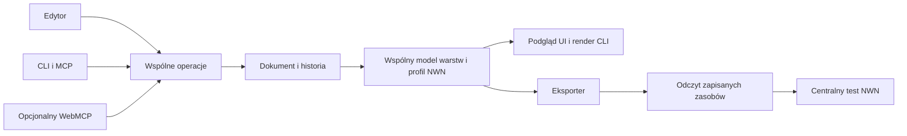

# NWN VFX Studio — kierunek produktu

Data: **2026-09-05**. Status: **wspólnie uzgodniony kierunek produktu; implementacja 0.1.0 alpha jest opisana w [raporcie](C:/Projects/nwn-vfx/docs/releases/0.1.0/acceptance.md)**. Zapisy o niewykonanych pracach poniżej odnoszą się do chwili pierwotnego uzgodnienia, a sekcje funkcjonalne określają cel V1.

Uczestnicy: bieżące zadanie oraz autor zadania [Zbadaj VFX w aurora-web](codex://threads/01a070e3-5df3-7913-943f-854ac8ea98ee), na bezpośrednie polecenie użytkownika. Dokument rozstrzyga kierunek wcześniej pozostawiony otwarty w audycie. [Kontrakt sterowania](C:/Projects/nwn-vfx/docs/design/human-ai-control-contract-draft.md) pozostaje szczegółową specyfikacją do wdrożenia.

## 1. Decyzja

Budujemy **osobne, webowe NWN VFX Studio w `C:\Projects\nwn-vfx`**: edytor warstwowy z osią czasu, podglądem, historią wariantów i eksportem do NWN. Użytkownik tworzy efekty wizualnie w przeglądarce, a zewnętrzny agent wykonuje te same operacje przez obowiązkowe CLI i późniejszy adapter MCP. WebMCP może dodatkowo udostępnić kontekst otwartej karty po sprawdzeniu zgodności hosta.

Webowy interfejs jest podstawową postacią produktu. Frontend komunikuje się z backendem API; pierwsze uruchomienie backendu jest lokalne. Lokalny adapter testów obsługuje dostęp do zainstalowanego NWN/Toolsetu i jest oddzielną możliwością. Edycja, podgląd oraz pobranie projektu i eksportu nie wymagają gry. Publiczny hosting, konta i praca wielu użytkowników są osobnymi decyzjami wdrożeniowymi; nie są potrzebne do rozpoczęcia implementacji.

Podstawowa pętla produktu:

**pomysł/preset → warstwy i parametry → podgląd → wariant A/B → eksport → ocena konkretnej wersji w NWN → korekta**.

Najważniejsza korzyść: użytkownik może wskazać, co chce poprawić w obrazie, zobaczyć ograniczoną zmianę i zachować udaną wersję. Właściwości formatu, identyfikatory plików i pakowanie obsługuje aplikacja; pozostają dostępne w inspektorze diagnostycznym.

Pierwszy profil produktu dotyczy **NWN: Enhanced Edition na Windows i krótkich efektów typu impact**. Dokładny build gry i obsługiwane zachowania ustala profil na podstawie zebranych dowodów; nie deklarujemy zgodności ze wszystkimi wydaniami NWN. Rozszerzanie o inne profile nie zmienia formatu operacji.

## 2. Dlaczego osobna aplikacja

| Opcja | Ocena w świetle audytu | Rozstrzygnięcie |
| --- | --- | --- |
| Osobne Studio | Można skupić interfejs, model dokumentu i CLI na tworzeniu VFX; wymaga własnego ograniczonego eksportera i podglądu | Wybrana |
| Moduł Aurora Web | Dostępne parsery i renderer, lecz duży kontekst edytora świata i wykazane ograniczenia zgodności podglądu | Referencje i wybrane komponenty, bez uzależnienia pierwszego odbioru od całego produktu |
| Rozbudowa Meshy2Aurora | Przydatne narzędzia geometrii/materiałów, ale pełny tor emiterów nie istnieje | Potencjalny dostawca zasobów i wąskich komponentów |
| Kolejne skrypty konkretnego efektu | Szybka demonstracja, ale parametry, eksport i podgląd pozostają rozdzielone | Materiał do migracji i testów |

To ocena dopasowania do tego zadania, nie ogólny ranking tych aplikacji. Wspólne narzędzia operacyjne Aurora/NWN pozostają centralne. Studio nie tworzy własnego launchera Toolsetu lub gry.

## 3. Jak użytkownik będzie pracował

Układ edytora: biblioteka i warstwy po lewej, scena pośrodku, właściwości zaznaczonej warstwy po prawej, oś czasu na dole. Historia, porównanie A/B i kolejka zadań są dostępne z tego samego projektu. Panele można zwinąć.

Użytkownik może rozpocząć pusty projekt albo wybrać preset. Dla każdej warstwy zmienia kształt/teksturę, kolor, przezroczystość, ruch i przebieg w czasie w zakresie właściwym dla danego typu. Izoluje warstwę, zatrzymuje efekt w danym momencie, ogląda alpha i porównuje jasne/ciemne tło oraz skalę względem postaci.

Przykład współpracy: „Przygotuj trzy wersje iskier: cięższe, krótsze i bardziej rozproszone. Zachowaj moment błysku i teksturę dymu”. Agent dostaje dozwolone parametry i ograniczenia, zapisuje osobne warianty, a UI pokazuje różnice oraz podglądy. Akceptacja artystyczna należy do człowieka. Nie trzeba potwierdzać każdej odwracalnej edycji objętej poleceniem.

Pierwsza wersja otwiera edytor pod lokalnym adresem w zwykłej przeglądarce, bez konta i bez obowiązkowego połączenia z modelem AI. Pełny przebieg człowieka jest dostępny w UI, łącznie z importem i pobieraniem plików. Zewnętrzny agent korzysta z CLI/MCP; wbudowany chat i orkiestracja agentów nie są warunkiem użyteczności edytora.

## 4. Jeden dokument, trzy rodzaje warstw

Źródłem authoringu jest **wersjonowany JSON projektu**, przechowywany wraz z historią w SQLite. Zawiera stabilne ID, docelowy profil, warstwy, generatory i ich wersje, parametry, seedy warstw, czas, zasoby i ograniczenia. Baza jest jedynym magazynem bieżących zapisów. Duże zasoby są niezmiennymi plikami indeksowanymi hashem.

Przenośny projekt jest paczką ZIP: dokument, manifest, potrzebne zasoby i pochodzenie. To import/eksport, nie drugi automatycznie zapisywany stan obok bazy. Oddzielny pakiet runtime zawiera wygenerowane zasoby NWN i dane potrzebne do ich podłączenia.

| Rodzaj warstwy | Pierwszy zakres edycji | Granica |
| --- | --- | --- |
| Emiter cząstek | Tekstura, orientacja, prędkość/rozrzut, czas życia, emisja, kolor/alfa/rozmiar przez życie | Podzbiór Explosion oraz ograniczony w czasie Fountain wewnątrz efektu impact; bez pełnej fizyki kolizji i dowolnej symulacji |
| Animowana geometria | Parametryczne łuki/ribbon, płaty/billboardy; materiał, transformacje, krzywe alfy | Wspólne generatory sterowane danymi; pierścienie i kolejne kształty jako rozszerzenia tego samego typu |
| Pojedyncze światło | Kontrolki właściwe dla potwierdzonego profilu, np. barwa i zasięg | Osobna kwalifikacja; nie obiecujemy pełnego ProgFX ani zgodności iluminacji na podstawie samego eksportu |

Krzywe rozróżniają **czas całego efektu** i **wiek cząstki**. Edytor wieku cząstki respektuje reprezentację dopuszczoną przez natywny profil; dowolna krzywa Béziera nie oznacza automatycznie możliwości bezstratnego eksportu. Moment wyzwolenia Explosion jest danymi dokumentu i mapowaniem zdarzenia eksportu, nie stałą `0.3` w rendererze.

Światło jest częścią docelowego zakresu V1, ale otrzymuje edytowalne możliwości dopiero po kwalifikacji wybranego podzbioru. Niepowodzenie próby światła musi zostać zgłoszone jako niespełniony punkt odbioru; nie wolno go po cichu usunąć ani zastąpić podświetlonym obrazem tła. Pozostałe niezależne prace mogą postępować.

## 5. Presety, import i odzyskanie dorobku

Podstawowy start to pusta kompozycja i niewielka biblioteka własnych presetów. V1 ma pełny import/eksport projektu Studio oraz kontrolowany import rozpoznanego podzbioru ASCII MDL. Uniwersalny importer dowolnego binary/ASCII MDL nie jest warunkiem pierwszego wydania.

Importer identyfikuje nieobsługiwane pola i zależności. Zachowuje oryginał jako zasób referencyjny; częściowej konwersji nie reklamuje jako bezstratnej. Eksport zmodyfikowanego projektu blokuje niejawne utracenie potrzebnej właściwości. Konwersja wspieranego wycinka musi jasno określać, który wycinek przeniosła.

**Coil V3 jest pierwszym projektem regresyjnym, a nie formatem Studio.** Obecnie [build_revision.py:177](C:/Projects/nwn/VFX/work/coil-overload-v3/scripts/build_revision.py:177) zapisuje `effect-design.json` po wygenerowaniu modelu, a [render_preview.py:17](C:/Projects/nwn/VFX/work/coil-overload-v3/scripts/render_preview.py:17) czyta ten JSON. Zmiana samego JSON nie steruje istniejącym eksporterem. Potrzebna jest migracja do wejściowego dokumentu i jednego modelu warstw obsługującego oba wyjścia.

Z Coil można odzyskać geometrię/presety, tekstury z pochodzeniem i niewielkie algorytmy po przeglądzie. Stałe kontaktów, impulsów, resrefów i seedów trzeba przenieść do danych. Aktualnego symulatora Pillow nie przenosimy jako autorytetu zachowania cząstek: zawiera ilustracyjną grawitację, clamp podłogi i dodatkowe korekty obrazu.

Kod produktu Aurora Web/Meshy2Aurora nie jest domyślną zależnością Studio. Dla wybranego komponentu zapisujemy źródło, zakres praw, granicę, testy oraz decyzję o wydzieleniu lub osobnej implementacji. Własny wąski eksporter nie odczytuje tekstu obcego skryptu i nie wycina z niego funkcji przez `Function`. Reguły reference-only Meshy2Aurora nie są ogólnym zakazem tworzenia osobnej aplikacji.

## 6. Podgląd, eksport i NWN

**Three.js jest warstwą rysowania; profil oraz wspólny model danych opisują znaczenie parametrów.** UI i zadania podglądu używają tego samego renderera. Render przez CLI przy zamkniętej karcie jest obowiązkowy: zarządzany Chromium wykonuje podgląd zadanej rewizji/sceny/czasu i zwraca obraz lub krótki film. Nie tworzymy drugiego renderera ilustracyjnego tylko dla AI.

Zgodność obu hostów Studio wymaga porównania tych samych scen i wersji; wspólny kod sam jej nie dowodzi. Deterministyczne seedy służą pracy w Studio. Nie obiecują identycznego losowania natywnych cząstek NWN. Każda właściwość ma osobne statusy podglądu, eksportu i potwierdzenia natywnego.

Pierwszy eksport: **ASCII MDL, TGA/TXI w obsługiwanym zakresie, HAK i przygotowanie dema**. Obecna paczka Coil wprost wymaga [dokładnego ASCII:210](C:/Projects/nwn/VFX/work/coil-overload-v3/scripts/package_demo.mjs:210); kompilacja NWScript nie stanowi dowodu kompilacji binary MDL. Binary MDL dodajemy dopiero po dowodzie zachowania kontrolerów.

Po buildzie odczytujemy rzeczywiście zapisane zasoby i porównujemy parametry, animacje, połączenia i tekstury. Walidator nie może zaliczać eksportu wyłącznie po znalezieniu `newmodel` albo porównaniu bajtów z plikiem wyprodukowanym przez ten sam błędny writer. Niezależne fixture'y/odczyt oraz test w NWN obejmują różne poziomy weryfikacji.

Eksport zasobów jest odrębny od instalacji/testu. Profile projektu określają strategię nazw i mapowania wierszy 2DA, bez stałego `10100` dla wszystkich efektów. Kolejność HAK oraz faktycznie rozstrzygnięte zasoby trafiają do manifestu. Powtarzalność obejmuje zawartość zasobów; ewentualna losowa tożsamość nowego kontenera jest jawnie wydzielona.

„Sprawdź w NWN” korzysta z centralnego AUR-S07 i kwalifikowanego profilu. Uruchamianie i nagranie wymagają działającej lokalnej gry oraz właściwego runnera, wskazywanych przez `doctor`. Brak tych narzędzi nie blokuje edycji, zapisów, renderu Studio i eksportu zasobów. Natywny test zachowuje wymagany niegłówny monitor i własność procesów.

## 7. Stack i dystrybucja

| Element | Wybór |
| --- | --- |
| Kod produktu | TypeScript, jedno repozytorium z modułami o wąskich interfejsach |
| Frontend webowy | React + Vite + Three.js; pełny edytor w przeglądarce |
| Backend API | Node.js 24 LTS + Fastify; początkowo lokalny, jedna instancja właściciela zapisu |
| Trwałość | SQLite przez adapter `better-sqlite3`; krótkie transakcje i migracje |
| Kontrakt | Jeden rejestr JSON Schema dla komend i wyników, generowanie opisów adapterów |
| Ciężka praca | Procesy robocze z kolejką, limitami, anulowaniem i trwałym statusem |
| Render bez UI | Przypięty Chromium/Playwright na żądanie, ten sam pakiet renderera |
| Pierwsze uruchomienie | Backend serwuje frontend pod lokalnym adresem; CLI `nwn-vfx` korzysta z tego samego API |
| Lokalna integracja NWN | Adapter istniejącego runnera na Windows, wykrywany oddzielnie od możliwości edytora |
| Pakiet lokalny | Docelowo prywatny runtime backendu i renderera oraz instalowalne CLI; użytkownik otwiera edytor w przeglądarce |

Wybraliśmy TS również dla CLI, aby dzielić schematy i operacje z usługą i UI. Nie dokładamy języka tylko dla powłoki poleceń. Małe sprawdzone narzędzia formatu mogą mieć własną implementację za adapterem; nie przenoszą do siebie stanu projektu.

To decyzja wdrożeniowa, nie przetestowany zestaw zależności. Lokalnie odczytano Node `v24.15.0`; implementacja przypnie kompatybilne wersje, sprawdzi binaria `better-sqlite3` i Chromium na Windows oraz instalację bez kompilatora/deweloperskiego środowiska użytkownika. Interfejs bazy nie zależy od eksperymentalnego `node:sqlite`.

Edycja lokalna nie wymaga Docker, serwera chmurowego ani konfiguracji modeli AI. Zarządzany worker podglądu używa własnej przeglądarki, a nie prywatnego profilu użytkownika. Frontend nie odczytuje dowolnych ścieżek komputera: import odbywa się przez wybór/przesłanie pliku, a eksport przez pobranie. Backend zarządza własnym magazynem. Przyszły hosting wymaga osobnego rozwiązania uwierzytelnienia, izolacji projektów oraz połączenia z lokalnym adapterem NWN; obecny tryb lokalny nie deklaruje gotowości do publicznego wystawienia.

Uzasadnienie narzędzi: React obsługuje interaktywne komponenty, Three.js scenę i materiały, Fastify ma mechanizmy JSON Schema, a SQLite służy m.in. lokalnym aplikacjom edytorskim. To nie zapewnia automatycznie poprawnego VFX. [React](https://react.dev/learn), [Three.js](https://threejs.org/manual/en/fundamentals.html), [Fastify](https://fastify.dev/docs/latest/Reference/Validation-and-Serialization/), [SQLite](https://www.sqlite.org/whentouse.html).

Dokumentacja `better-sqlite3` opisuje transakcje i gotowe binaria dla głównych platform; Playwright wiąże swoją wersję z wersją przeglądarki. Te zależności wymagają testu dystrybucji. [better-sqlite3](https://github.com/WiseLibs/better-sqlite3), [Playwright](https://playwright.dev/docs/browsers), [wydania Node](https://nodejs.org/en/about/previous-releases).

## 8. Co ma być gotowe w pierwszej wersji

| Obszar | Obowiązkowy rezultat |
| --- | --- |
| Rozpoczęcie pracy | Pusty projekt i presety; import/eksport projektu Studio; kontrolowany podzbiór ASCII MDL |
| Edycja | Warstwy, oś czasu, podstawowe krzywe, tekstury/alpha, parametry ruchu, jednostki i ograniczenia |
| Współpraca | UI i CLI zmieniają ten sam projekt; historia, konflikt, selektywne undo i wstrzymanie zapisów AI |
| Ocena | Podgląd z normalnej kamery gry, skala postaci, izolowanie warstw, zapis dwóch wariantów i uwagi |
| Praca bez karty | Create/edit/save/render/export i jobs przez instalowalne CLI |
| Droga do gry | Nieutracone parametry eksportu, komplet zależności, kwalifikowany profil testu i zapisany materiał z NWN |
| Ogólność | Dwa efekty impact z tych samych typów warstw, bez zmian kodu zależnych od ich nazw |

Projekty odbiorcze: **przeciążenie cewki** oraz **rozbicie fiolki alchemicznej**. Fiolka wykorzystuje wyrzut drobin, błysk i wygasającą mgiełkę/pozostałość; nie wprowadza symulacji cieczy ani osobnego silnika fizyki.

Pełny scenariusz: utworzyć projekt przez CLI, otworzyć w UI, zmienić teksturę/alfę, ruch iskier oraz czas błysku; zapisać A/B; zamknąć i ponownie uruchomić usługę; cofnąć zmianę AI, zachowując niezależną zmianę człowieka; przenieść projekt przez paczkę; wyrenderować bez karty; zbudować i odczytać kandydata; obejrzeć dokładną wersję w NWN. Powtórzyć na drugim efekcie. Nie wszystkie warianty muszą być ładne; użytkownik ma umieć wskazać udaną korektę i ją zachować.

Mierniki: **zero ręcznej edycji plików w obsługiwanym przebiegu**, brak utraty zmian/duplikacji skutku po ponowieniu, czas od parametru do podglądu, czas przygotowania kandydata i liczba ręcznych operacji poza aplikacją. Cele do pomiaru po ustaleniu małej sceny oraz sprzętu: reakcja podglądu p95 poniżej 150 ms i przygotowanie porównywalnego wariantu przez użytkownika w 10 minut po krótkim wprowadzeniu. Nie są obecnymi wynikami ani obietnicą jakości artystycznej w określonym czasie.

## 9. Kolejność i eksperyment rozstrzygający

| Etap | Co dostarcza | Warunek przejścia |
| --- | --- | --- |
| A — sprawdzenie ryzyka | Mały dokument, zmiana jednego emitera, zapis/eksport/niezależny odczyt i podgląd; próba natywna | Zmiana rozmiaru oraz niejednostkowa skala rodzica nie gubią danych; obserwacja NWN pozwala ocenić kierunek zmiany |
| B — działający edytor | Usługa/CLI/UI, trwałość, warstwy, krzywe, tekstury, undo, render bez karty | Pełny lokalny przebieg na obu projektach, razem z próbami konkurencji i odzyskiwania |
| C — odbiór V1 | Kwalifikowane możliwości trzech typów warstw, pakowanie, integracja runnera, porównanie w NWN i dystrybucja | Cały scenariusz sekcji 8 działa; dwa efekty i ocena użytkownika; niespełnione punkty pozostają jawne |
| D — integracje i rozszerzenia | MCP po pionowym przebiegu; WebMCP po teście hosta; później biblioteka, plansze wariantów i kolejne rodziny | Każdy adapter zachowuje te same wyniki i błędy; nowa rodzina ma własne kryteria eksportu oraz oceny |

Pierwszy eksperyment ma mały działający ekran webowy: utworzenie projektu, jeden emiter, kilka parametrów, odtwarzanie podglądu, zapis i pobranie eksportu. Te same operacje wykonuje CLI przez backend API. Baza i wariant różnią się jednym parametrem emitera, następny przypadek skalą rodzica. Porównujemy rozmiar względem postaci, start, zanik, kierunek i mieszanie tekstury; nie identyczność losowych pozycji piksel po pikselu. Jeśli wynik sugeruje użytkownikowi błędną korektę, najpierw poprawiamy profil/podgląd/eksport. Awaria samego nagrania lub runnera nie uzasadnia przebudowy modelu.

Uzupełniające próby offline: dwa różne dokumenty przechodzą przez ten sam generator bez zmian źródeł; powtarzalny build daje te same zasoby; nazwy/wiersze dwóch efektów nie kolidują; zmiana seeda jednej warstwy nie zmienia niezależnych warstw; readback obejmuje klucze i zdarzenia, nie sam nagłówek MDL. To plan testów, nie wyniki tego uzgodnienia.

Etapy B i D mogą częściowo postępować równolegle z kwalifikacją natywną, ale brakującego odbioru NWN nie wolno przemianować na ukończoną V1. Nie wyznaczamy dat wdrożenia przed eksperymentem A i pomiarem rzeczywistego kosztu.

## 10. Kolejne rozszerzenia

Po V1: długotrwałe efekty i emitery środowiskowe, kotwiczenie do poruszających się obiektów, trail/beam, kolejni importerzy i binary MDL, większe biblioteki, plansze wielu wariantów, analiza wpływu parametrów, graf sekwencji i profilowanie. Fountain emitujący krótko wewnątrz impact jest już zakresem V1; później rozszerzamy długożyjące/persistent scenariusze.

WebMCP pozostaje opcjonalnym wejściem w otwartej karcie, a MCP Apps możliwym panelem A/B w zgodnym hoście. Obsługa AI jest dostępna od pierwszej wersji przez CLI. Podstawy aplikacji nie czekają na standard przeglądarkowy. [WebMCP](https://webmachinelearning.github.io/webmcp/), [MCP Apps](https://modelcontextprotocol.io/extensions/apps/overview).

## 11. Zapis uzgodnienia

Pierwsze stanowisko autora zapisano w turze `01a071c8-b64e-7150-829b-d11ce7c248d1`. Przyjęto jego trzy korekty: drugi efekt odbiorczy, kontrolowany import MDL i obowiązkowy render CLI bez aktywnej karty. Dodatkowy przegląd lokalnych skryptów wykazał, że JSON Coil jest wyjściem oraz że obecny pakiet używa ASCII — uwzględniono to w kierunku formatu i eksportu.

Po przeczytaniu tego dokumentu autor w turze `01a071d4-5674-79b3-826d-df916972b09a` potwierdził wspólne stanowisko i brak koniecznych poprawek. Jawnie zaakceptował krótką emisję Fountain w V1, migrację JSON Coil do wejściowego dokumentu, render bez karty, dwa efekty odbiorcze oraz osobną kwalifikację światła. Uzgodnienie nie pozostawia wyboru miejsca produktu do ponownego pytania użytkownika.

Dokument opisuje uzgodnienia i przyszłe kryteria. W tej pracy nie zmieniano assetów, generatorów, runnerów ani instalacji gry; nie uruchamiano aplikacji i nie wykonano eksperymentu A.

Po uzgodnieniu użytkownik doprecyzował, że produktem ma być narzędzie webowe. Powyższy zapis eksponuje przeglądarkę jako podstawowy interfejs, rozdziela backend i lokalny adapter NWN oraz dodaje mały ekran webowy do pierwszego eksperymentu. Autor przyjął aktualizację w turze `01a071de-3a90-77a0-aa30-77ea673b6353`: potwierdził brak sprzeczności i gotowość do rozpoczęcia eksperymentu A. Zgodność z NWN oraz zależności pozostają do sprawdzenia podczas wdrożenia.

## 12. Gotowość do implementacji

**Można rozpocząć etap A.** Cel produktu, granice V1, model sterowania człowiek/AI i kryteria odbioru są wystarczająco określone. Nie jest potrzebny kolejny ogólny audyt przed pisaniem kodu.

Szczegółowe zadania, zależności, bramki i definicję zakończenia zawiera [plan implementacji](C:/Projects/nwn-vfx/docs/plans/implementation-plan.md). [Integracja agentów z innych projektów](C:/Projects/nwn-vfx/docs/design/external-agent-integration.md), w tym `the last city`, jest obowiązkową częścią V1 przez CLI/API i otrzymuje własny scenariusz odbioru.

Pierwsza implementacja musi dopiero dostarczyć wykonywalne schematy i operacje, zapis z rewizjami, frontend, CLI oraz pierwszy eksporter i renderer. Zgodność z NWN, obsługa światła i instalacja zależności pozostają próbami do wykonania, a nie potwierdzonymi właściwościami aplikacji. Integracje MCP/WebMCP mogą powstać po pierwszym działającym przebiegu i nie blokują jego rozpoczęcia.
